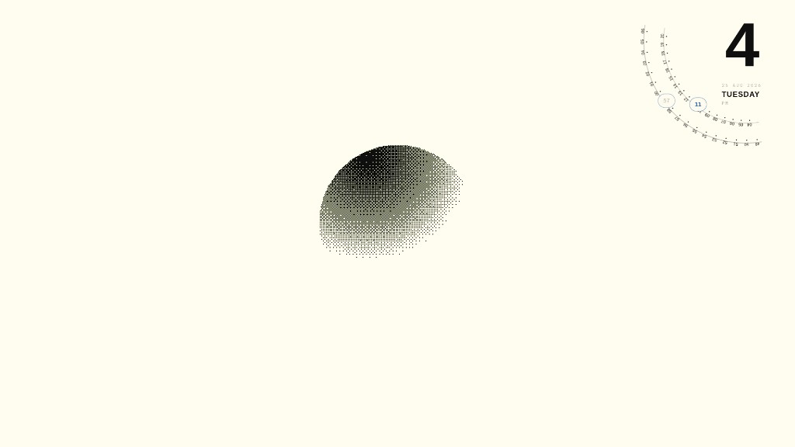
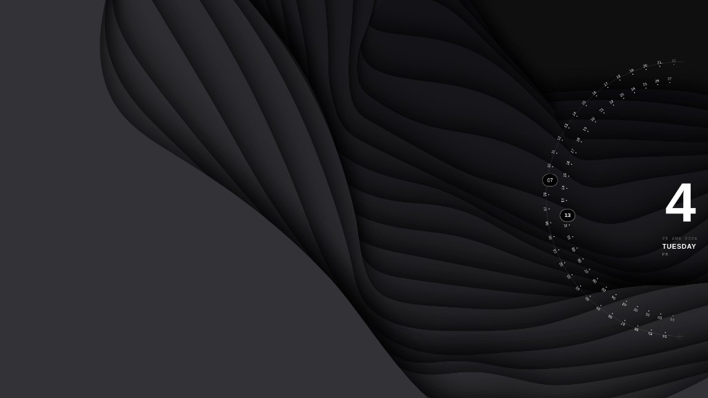

# Orbital Clock

A third-party [Omarchy](https://omarchy.org) shell plugin that renders a large desktop clock on your wallpaper. The design pairs a bold hour numeral with two smooth orbital rings for minutes and seconds, inspired by terminal-style and Ryoku-like orbital layouts.

The clock lives on the wallpaper layer (below windows), respects the Omarchy bar when placed on the same edge, and adapts ring size to your monitor height.

## Preview

All shots use `top-right` with a vertical bar — hour against the bar, rings curving inward, minute/second capsules at the focus.

| Space wallpaper | Light wallpaper | Dark layered wallpaper |
| --- | --- | --- |
|  |  |  |
| **Contrast** rings on a busy background | **Mono** rings on a minimal background | Full rings with tick labels on a dark theme |

`preview.png` is the marketplace listing image. Additional reference shots live in [`docs/`](docs/).

## Features

- **Large hour display** with optional date block (short date, weekday, AM/PM)
- **Two orbital dot rings** with numeric labels at every tick (00–59)
  - Inner ring: minutes (smooth rotation)
  - Outer ring: seconds (smooth rotation)
- **Individual capsules** at the 9 o'clock focus — one for `MM`, one for `SS`
- **Multi-monitor** — one wallpaper-layer clock per output; each screen sizes and positions independently (portrait, ultrawide, mixed resolutions)
- **Screen-aware sizing** — outer ring scales from each monitor's width and height (default ~40% of screen height, adjustable 25–55%)
- **Bar-aware placement** — auto-insets from the Omarchy bar on the anchored edge, per screen
- **Smooth animation** — ring repaints capped at 60 Hz (1 Hz when seconds are off)
- **Theme integration** — uses Omarchy palette (`foreground`, `background`, `muted`, `accent`) with live theme updates; **Contrast** mode draws rings opposite the theme background for wallpaper visibility
- **Ring transparency** — single slider fades both rings (0–100%)
- **Independent sizing** — layout, ring geometry, text, and fonts are separate controls (see [Sizing](#sizing))
- **Configurable ring arc** — show 30°–360° of the dial, centered on the focus (defaults by position)
- **GUI settings panel** — right-click to open; **General**, **Fonts & sizes**, and **Monitors** tabs, live preview, **Reset to defaults**, instant save to `shell.json`
- **Layout styles** — five presentation styles (orbit, minimal, sunburst, single, digital) at **any** screen position; focus direction and border hugging follow position

## Requirements

- **Omarchy 4.x** with shell plugins enabled
- **Wayland** session (Quickshell layer-shell surface)
- Fonts used by default (optional but recommended):
  - `Liberation Sans` — hour and date
  - `JetBrainsMono Nerd Font` — ring labels (falls back to system mono)

## Installation

### Option A — Omarchy plugin command (recommended)

```bash
omarchy plugin add https://github.com/MASH2RAFI/omarchy-orbital-clock.git --enable
omarchy restart shell
```

### Option B — Symlink (development)

```bash
git clone https://github.com/MASH2RAFI/omarchy-orbital-clock.git ~/Projects/omarchy-orbital-clock

ln -sfn ~/Projects/omarchy-orbital-clock \
  ~/.config/omarchy/plugins/MASH2RAFI.orbital-clock

omarchy plugin enable MASH2RAFI.orbital-clock
omarchy restart shell
```

### Option C — Copy into plugins directory

```bash
git clone https://github.com/MASH2RAFI/omarchy-orbital-clock.git
cp -r omarchy-orbital-clock ~/.config/omarchy/plugins/MASH2RAFI.orbital-clock
omarchy plugin enable MASH2RAFI.orbital-clock
omarchy restart shell
```

The plugin id **must** match the directory name: `MASH2RAFI.orbital-clock`.

## Configuration

Add or edit the plugin entry in `~/.config/omarchy/shell.json`:

```json
{
  "plugins": [
    {
      "id": "MASH2RAFI.orbital-clock",
      "scale": 1,
      "hourScale": 1,
      "dateScale": 1,
      "subtimeScale": 1,
      "ringLabelScale": 1,
      "position": "middle-right",
      "centerLayout": "orbit",
      "use24h": false,
      "showSeconds": true,
      "showDate": true,
      "accentMode": "contrast",
      "ringDiameter": 0.40,
      "ringGap": 48,
      "ringArcDegrees": 0,
      "ringTransparency": 1,
      "screenMode": "all",
      "selectedMonitors": [],
      "margin": 12,
      "barPadding": 0,
      "clockFont": "Liberation Sans",
      "labelFont": "JetBrainsMono Nerd Font,JetBrainsMono NF"
    }
  ]
}
```

After editing `shell.json`:

```bash
omarchy-shell shell rescanPlugins
omarchy restart shell
```

### Settings menu (GUI)

Right-click the clock on your wallpaper to open the settings overlay (layer-shell popup — floats above windows, not a tiled Hyprland window). Changes apply immediately and are saved to `shell.json`.

The panel has three tabs with a **sticky live preview** at the top. Changes apply immediately via `shell.updateEntryInline()` and are written to `shell.json`. Font pickers use a scrollable dropdown (`FontDropdown`) when the list is longer than six rows.

| Tab | Controls |
|-----|----------|
| **General** | Position, layout style, ring diameter, ring spacing, **ring arc**, ring transparency, seconds ring toggle, ring colors, 24h/date toggles |
| **Fonts & sizes** | Layout size, ring label size, hour/date/subtime sizes, hour & date font, ring label font |
| **Monitors** | Per-output toggles, display presets, scale-per-monitor, edge margin, bar padding |

**General → Layout → Position** also resets **Ring arc** to that position's default (corner 90°, edge 180°, center 360°). Override with the arc slider afterward.

Each monitor has a **Show clock on this monitor** toggle; **Select all** / **Select none** are at the top of the Monitors tab.

### Bar widget

When the plugin is enabled, a **bar widget** is added to your Omarchy bar (default: center section, after the clock). Omarchy removes it automatically when you disable or uninstall the plugin.

| Action | Effect |
|--------|--------|
| **Left click** | Toggle the wallpaper clock on/off (`clockEnabled`) |
| **Right click** | Open settings |

Move it like any bar widget: `omarchy bar move MASH2RAFI.orbital-clock --section center --after omarchy.clock`

You can also open settings from the terminal:

```bash
omarchy-shell shell summon MASH2RAFI.orbital-clock "{}"
```

Close with **Esc**, clicking the scrim, or the **Close** button.

### Settings reference

| Key | Type | Default | Description |
|-----|------|---------|-------------|
| `scale` | number | `1` | Layout size — capsule chrome and dial padding (`0.5`–`2.5`) |
| `hourScale` | number | `1` | Hour numeral (`0.5`–`2.5`) |
| `dateScale` | number | `1` | Date block (`0.5`–`2.5`) |
| `subtimeScale` | number | `1` | Subtime line and capsule text (`0.5`–`2.5`) |
| `ringLabelScale` | number | `1` | Ring tick labels 00–59 (`0.5`–`2.5`) |
| `position` | string | `middle-right` | Screen anchor — see [Positions](#positions) |
| `centerLayout` | string | `orbit` | Layout style — see [Layout styles](#layout-styles) |
| `use24h` | boolean | `false` | 24-hour hour label |
| `showSeconds` | boolean | `true` | Show outer seconds ring and capsule |
| `clockEnabled` | boolean | `true` | Master visibility toggle (bar widget) |
| `showDate` | boolean | `true` | Show date block under the hour |
| `accentMode` | string | `contrast` | Ring colors — `contrast` (opposite theme bg), `accent`, `theme`, `mono` |
| `ringDiameter` | number | `0.40` | Outer ring size (% of screen height, 25–55%) — independent of layout size |
| `ringGap` | number | `48` | Gap between minute and seconds rings (px) — independent of layout size |
| `ringArcDegrees` | number | `0` | Visible ring arc (30–360°). `0` = position default (corner 90°, edge 180°, center 360°) |
| `ringTransparency` | number | `1` | Ring visibility for both rings (0–100%) |
| `screenMode` | string | `all` | Quick preset — `all`, `selected` (custom picks), `primary`, `focused`, `external` |
| `selectedMonitors` | list | `[]` | Monitor names when using custom selection (set via Monitors tab toggles) |
| `perMonitorScale` | boolean | `false` | Scale clock size by each monitor height |
| `scaleReferenceHeight` | number | `1080` | Reference height (px) for per-monitor scaling |
| `margin` | number | `12` | Distance from screen edge (px) |
| `barPadding` | number | `0` | Extra inset from bar; `0` = auto-detect |
| `clockFont` | string | `Liberation Sans` | Hour and date font |
| `labelFont` | string | `JetBrainsMono Nerd Font,…` | Ring tick label font |

Omitted keys fall back sensibly: `dateScale` / `subtimeScale` inherit `hourScale`; `ringLabelScale` inherits `scale` on first load.

### Sizing

All size sliders are **independent** — changing one does not change the others.

| Control | Key | Tab | Affects |
|---------|-----|-----|---------|
| Layout size | `scale` | Fonts & sizes | Capsule pill chrome, guide strokes, dial padding |
| Ring diameter | `ringDiameter` | General | Outer radius (% screen height, 25–55%) |
| Ring spacing | `ringGap` | General | Pixel gap between minute and seconds rings |
| Ring arc | `ringArcDegrees` | General | Visible arc in degrees (360° = full circle) |
| Ring label size | `ringLabelScale` | Fonts & sizes | 00–59 tick labels on the rings |
| Hour size | `hourScale` | Fonts & sizes | Large hour numeral |
| Date size | `dateScale` | Fonts & sizes | Date and weekday block |
| Subtime size | `subtimeScale` | Fonts & sizes | MM:SS under the hour and capsule text |

`perMonitorScale` (Monitors tab) only multiplies **layout size** (`scale`) by monitor height — not ring diameter, text sizes, or arc.

### Positions

`position` accepts any of:

`top-left`, `top-center`, `top-right`, `middle-left`, `middle-center`, `middle-right`, `bottom-left`, `bottom-center`, `bottom-right`

The first segment controls vertical alignment; `left` or `right` in the name sets which screen edge the hour hugs.

**Suggested setup:** `middle-right` with a right-side vertical bar.

Ring geometry is driven by **position** (focus direction and border hugging). **Ring arc** sets how many degrees of the dial are visible (30–360°), centered on that focus.

| Position type | Examples | Default arc |
|---------------|----------|-------------|
| Center | `middle-center` | **360°** full dial |
| Middle edge | `middle-left`, `middle-right`, `top-center`, `bottom-center` | **180°** |
| Corner | `top-left`, `top-right`, `bottom-left`, `bottom-right` | **90°** |

Changing **Position** resets the arc slider to that default. Set **Ring arc** on the General tab to override (30–360°). Store `0` or omit `ringArcDegrees` in `shell.json` to keep position-based defaults on load.

The hour sits at the center of the rings at every position. **Ring diameter** scales the outer radius as a percentage of screen height (25–55%), capped by each position's border-to-border maximum.

### Layout styles

`centerLayout` controls **presentation only** — capsules, subtime placement, ring weight, and guide ring visibility. Ring focus and border hugging follow `position`; arc span is set by **Ring arc**.

| Style | Description |
|-------|-------------|
| `orbit` | Default — minute/second capsules toward screen center |
| `minimal` | No capsules; minute/second under the hour |
| `sunburst` | Capsules at 12 & 6 (center) or at the two ends of the visible arc (corners/edges) |
| `single` | One combined `MM:SS` capsule |
| `digital` | Bold hour, faint rings, no guide ring |

Legacy values in `shell.json` are mapped automatically: `dial`/`split`/`arc` → `orbit`, `stack` → `minimal`, `single-focus` → `single`.

## Multi-monitor

The clock uses Omarchy's standard **`Variants { model: Quickshell.screens }`** pattern — one full-screen wallpaper layer per connected output, same as the background and notification plugins.

| Behavior | Detail |
|----------|--------|
| **One clock per monitor** | Every screen gets its own instance, positioned independently within that output |
| **Per-screen sizing** | Ring radius fits both the monitor's height **and** width (ultrawide, portrait, small laptop) |
| **Bar insets** | Top/left/right/bottom bar clearance applies only when the clock anchor shares that edge |
| **Hotplug / layout changes** | `ScreenMoveRemap` hides the layer briefly while Hyprland moves outputs, then restores |
| **Placement clamp** | Clock is kept fully on-screen even when the combined dial + hour block is large |

There is no per-monitor position config — the same position and scale apply to all outputs, but each screen computes its own fit from its resolution. Open **Monitors** to toggle which outputs show the clock (always-visible toggles per output), set per-monitor scaling, edge margin, and bar padding. Use **Quick preset** for all monitors, focused, primary/internal, or external-only rules.

## Performance

The clock runs **inside quickshell** (same process as the bar and other shell plugins) — there is no separate clock process.

Rings are drawn with **`RingCanvas.qml`** — 60 ticks per ring, labeled 00–59 at every tick. Repaints are capped at **60 Hz** (even on high-refresh monitors) and drop to **~1 Hz** when the seconds ring is off. The settings preview uses a slower tick (`lowPower`) to save CPU while editing.

| | Omarchy shell + clock | Omarchy shell only | Clock delta (approx.) |
|---|---|---|---|
| **RAM** | ~480 MB | ~415 MB | **~60 MB** |
| **CPU** | ~15–20% of one core | ~13% | **~2–8% of one core** |

These figures vary by monitor count, layout, and whether the seconds ring is on. `ps` `%CPU` is a **lifetime average** — for a live reading, sample over a few seconds:

```bash
python3 - <<'PY'
import os, time
pid = int(os.popen("pgrep -x quickshell").read())
ncpu = os.cpu_count()
def pt():
    p = open(f"/proc/{pid}/stat").read().split()
    return int(p[13]) + int(p[14])
def st():
    return sum(int(x) for x in open("/proc/stat").read().splitlines()[0].split()[1:8])
rss = next(l for l in open(f"/proc/{pid}/status") if l.startswith("VmRSS:"))
p0, s0 = pt(), st(); time.sleep(3); p1, s1 = pt(), st()
cpu = 100 * (p1 - p0) / (s1 - s0) * ncpu
print(rss, f"CPU: {cpu:.1f}% of one core (~{cpu/ncpu:.1f}% of all cores)")
PY
```

Turn off **Seconds ring** (General tab) for the lowest CPU use (~1 repaint/sec).

## Development

### Project layout

```
omarchy-orbital-clock/
├── manifest.json          # Plugin metadata and settings schema
├── preview.png            # Marketplace preview screenshot
├── docs/                  # Extra reference screenshots for README
│   ├── reference-light-wallpaper.png
│   └── reference-dark-layers.png
├── Service.qml            # Layer-shell window, placement, config wiring
├── BarWidget.qml          # Bar toggle + settings shortcut
├── OrbitalClockFace.qml   # Clock UI: rings, capsules, hour, date
├── RingCanvas.qml         # 60-tick ring dial (minute + second rings)
├── DateColumn.qml         # Shared date/weekday/AM-PM column
├── TimeCapsule.qml        # Minute/second pill capsule
├── PluginConfig.js        # Shared shell.json plugin entry helpers
├── SettingsPanel.qml      # GUI settings overlay (panel entry point)
├── SettingsSlider.qml     # Reusable labeled slider row for settings
├── FontDropdown.qml       # Scrollable font picker for settings
├── FontOptions.js         # Curated clock/label font lists
├── ClockModel.js          # Time formatting and ring rotation math
├── ClockTheme.js          # Theme palette mapping (contrast/accent/theme/mono)
├── README.md
└── LICENSE
```

### Reload after changes

If the plugin directory is symlinked, save files and run:

```bash
omarchy restart shell
```

Or rescan without a full restart:

```bash
omarchy-shell shell rescanPlugins
```

### Debugging

Check recent shell logs for plugin errors:

```bash
journalctl --user --since "5 min ago" --no-pager | rg -i "orbital|SettingsPanel|SettingsSlider|load failed"
```

Rescan plugins and open the settings panel from the terminal:

```bash
omarchy-shell shell rescanPlugins
omarchy-shell shell summon MASH2RAFI.orbital-clock "{}"
```

Common issues:

| Symptom | Fix |
|---------|-----|
| Clock not visible | QML load error — check logs above |
| Settings won't open | QML error in panel — look for `SettingsPanel` / `SettingsSlider` / `FontDropdown` in logs |
| Settings change but clock doesn't update | Restart shell once; `Service.qml` reads `shell.shellConfig` for live updates |
| Clock under bar | Increase **Edge margin** or **Bar padding** (Monitors tab) |
| Rings too large/small | **Ring diameter** or **Layout size** (General / Fonts & sizes) |
| Wrong arc span | **Ring arc** on General tab; changing position resets arc to default |
| Hour/date/subtime too large/small | **Fonts & sizes** tab |
| Ring labels too large/small | **Ring label size** on Fonts & sizes tab |
| High CPU usage | Expected with seconds ring on — see [Performance](#performance) |

### Architecture notes

- **`Service.qml`** — one bottom-layer `PanelWindow` per monitor; reads normalized settings from `Clock.readSettings()` via a `cfg` object; applies bar-aware placement and per-monitor layout scale. Right-click summons the settings panel.
- **`SettingsPanel.qml`** — panel entry point: three-tab overlay with live preview. Uses a single `draft` settings object updated through `patchDraft()` → `Clock.mergeSettings()` → `shell.updateEntryInline()`.
- **`SettingsSlider.qml`** — reusable labeled slider row (`import qs.Ui` for `PanelSlider`). Used on General and Fonts & sizes tabs. Same-directory QML components load by type name — no extra import line needed in the panel.
- **`OrbitalClockFace.qml`** — composes rings, hour/date column, and capsules. Layout/text scales are independent properties; ring arc comes from `Clock.layoutSpec(position, centerLayout, ringArcDegrees)`.
- **`RingCanvas.qml`** — Canvas ring dial with separate `labelScale` (tick labels) and `chromeScale` (guide strokes). Arc clipping via `arcFrom` / `arcTo`.
- **`ClockModel.js`** — `.pragma library` module: time parts, `readSettings` / `mergeSettings` / `settingsToEntry`, placement geometry, layout specs, arc rules, ring math.
- **`ClockTheme.js`** — `accentMode` palette mapping (contrast / accent / theme / mono).
- **`PluginConfig.js`** — `entryOrDefault()` and `defaultSettings()` helpers.
- **`FontDropdown.qml`** + **`FontOptions.js`** — scrollable font picker and curated font lists.
- **`DateColumn.qml`** / **`TimeCapsule.qml`** — shared date block and MM/SS capsule widgets.

## Uninstall

```bash
omarchy plugin disable MASH2RAFI.orbital-clock
rm ~/.config/omarchy/plugins/MASH2RAFI.orbital-clock   # skip if symlink — remove link only
omarchy restart shell
```

Remove the plugin block from `~/.config/omarchy/shell.json` if you added one.

## License

MIT — see [LICENSE](LICENSE).
